# Novels Note JP

> 日本語小説執筆に特化した Obsidian 用 統合執筆支援プラグイン  
> 縦書き・ルビ・用語管理・小説閲覧ビュー・原稿 Export まで、日本語小説執筆に必要な機能を統合。

---

# 概要

Novels Note JP は、日本語 Web小説・ライトノベル・長編小説執筆向けに設計された Obsidian プラグインです。
Markdown の自由さと Obsidian の知識管理能力を維持したまま、

- 小説向けエディタ最適化
- 用語・人物管理
- 日本語縦書きプレビュー
- 小説閲覧ビュー（横書き清書表示）
- ルビ
- 原稿整形
- 小説向け文字数カウント

などを統合し、Obsidian を「日本語小説執筆環境」として拡張します。

---

# スクリーンショット

## エディタ

- 用語ハイライト
- カッコ強調
- 全角スペース可視化
- 小説向け行幅


---

# 特徴

## 日本語小説向けに最適化

一般的な Markdown エディタでは扱いづらい、

- 日本語ルビ
- 縦書き
- 会話カッコ
- 全角スペース
- 原稿用紙換算文字数

などを、執筆時点から自然に扱えます。

---

## Obsidian の機能をそのまま活用

- WikiLink
- Tags
- Backlinks
- Graph View
- Vault 管理

など、Obsidian 本来の知識管理機能を維持したまま、小説執筆へ特化できます。

---

# 主な機能

| 機能                 | 内容                                       |
| -------------------- | ------------------------------------------ |
| 用語ハイライト       | 登場人物・組織・用語を自動強調             |
| 用語インデックス     | 用語一覧をサイドバー表示                   |
| カッコハイライト     | 会話記号を視覚強調                         |
| 全角スペース可視化   | 段落確認を容易化                           |
| 縦書きプレビュー     | 日本語向け、縦書き表示                     |
| 小説閲覧ビュー       | `mode: novel` ファイルを横書きで清書表示   |
| ルビ対応             | なろう式 / 青空文庫式 等                   |
| 小説向け文字数カウント | 原稿用紙換算対応                         |
| 原稿 Export          | 投稿サイト向け整形                         |
| エディタ最適化       | 行幅・行間・ガイドライン調整               |

---

# インストール

## Community Plugins

Community Plugins からの配布予定はありません。

---

## 手動インストール

1. GitHub の右リスト `Releases` より最新の `novels-note-jp.zip` をダウンロードして解凍
2. `Vault/.obsidian/plugins/novels-note-jp/` に配置
3. Obsidian を再起動して有効化

または

1. ターミナルにて `git clone https://github.com/p77-don/novels-note-jp` を実行  
   ※ Git のインストールが必要
2. `Vault/.obsidian/plugins/novels-note-jp/` に配置
3. Obsidian を再起動して有効化

---

# クイックスタート

## 1. 用語ノートを作成

```
File Name 猫.md
---
tags:
  - character
aliases:
  - 吾輩
---
```
ファイル名と`aliases`に登録された文字列がハイライト表示されます。

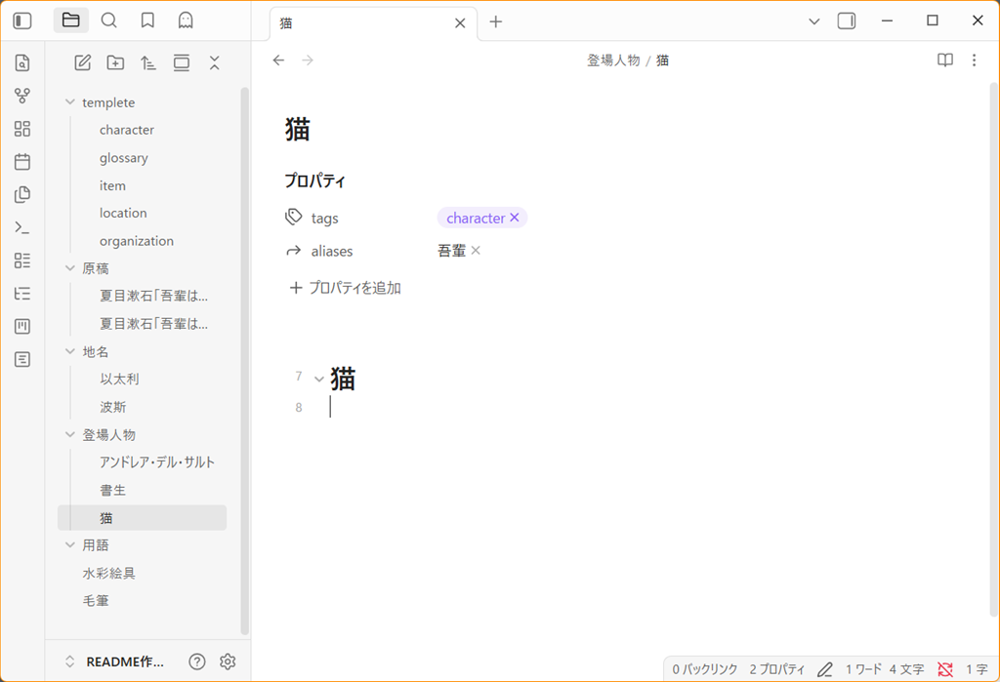

### テンプレートのサンプル

`.obsidian/plugins/novels-note-jp/templete/` にテンプレートのサンプルが用意してあります。`.obsidian` フォルダ内はテンプレートの対象外なので `vault root` 以下にコピーして使用してください。

---

## 2. 原稿を書く

原稿であることを示す `Frontmatter` を記述します。
```Frontmatter
---
mode: novel
---
```
※この記述があるファイルが原稿ファイルとして認識され。編集モード時にハイライト表示されます。

↓

文章を書きます。
```
吾輩は猫である。
```

↓

`吾輩`と`猫`がハイライト表示されます。

---

## 3. 縦書きプレビュー

原稿を日本語向け縦書きレイアウトで表示します。
- リボンアイコン　　をクリックする。
- コマンド`縦書きプレビューを開く`を実行する。

### 対応

- 縦書き
- ルビ
- 日本語レイアウト
- カーソル位置の自動スクロール

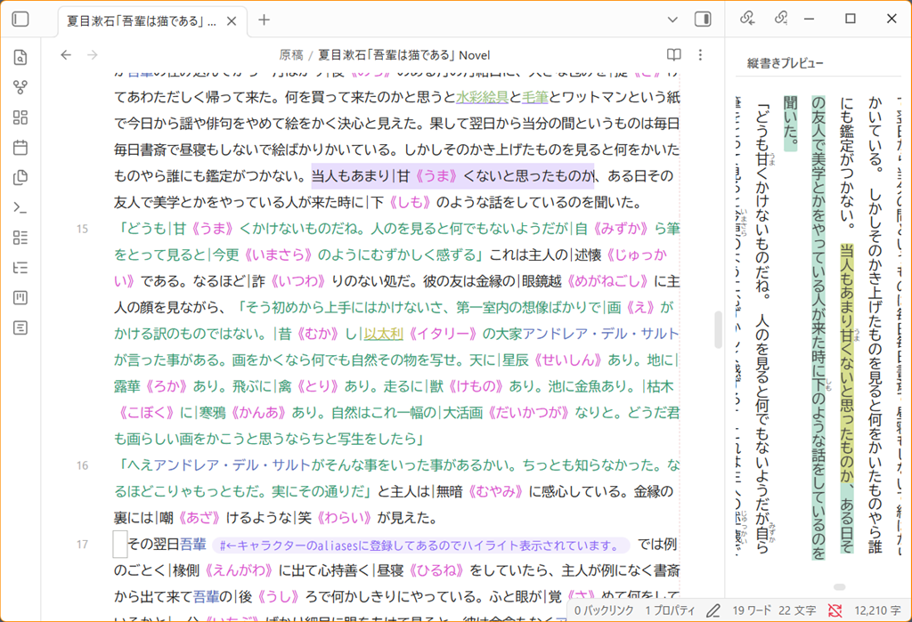

---

## 4. 小説閲覧ビューで読む

原稿ファイルの Frontmatter に `mode: novel` が記述されていると、小説閲覧ビューで清書表示できます。

リボンアイコン　　「小説用ビューで表示」またはコマンドから開きます。


`Frontmatter` に `mode: novel` が記述されているファイルを、横書きの清書レイアウトで表示します。  

* リボンアイコン　　をクリックする。
* コマンド`小説閲覧ビューを開く`を実行する。

編集ビューと独立したタブとして開き、「編集に戻る」ボタンで元のエディタに切り替えられます。

### 対応

- ルビ変換表示
- 折り返し文字数の設定値に連動
- ツールバーから編集モードへの切り替え
- 原稿エクスポート。※メインペイン右上のリボン　　をクリック

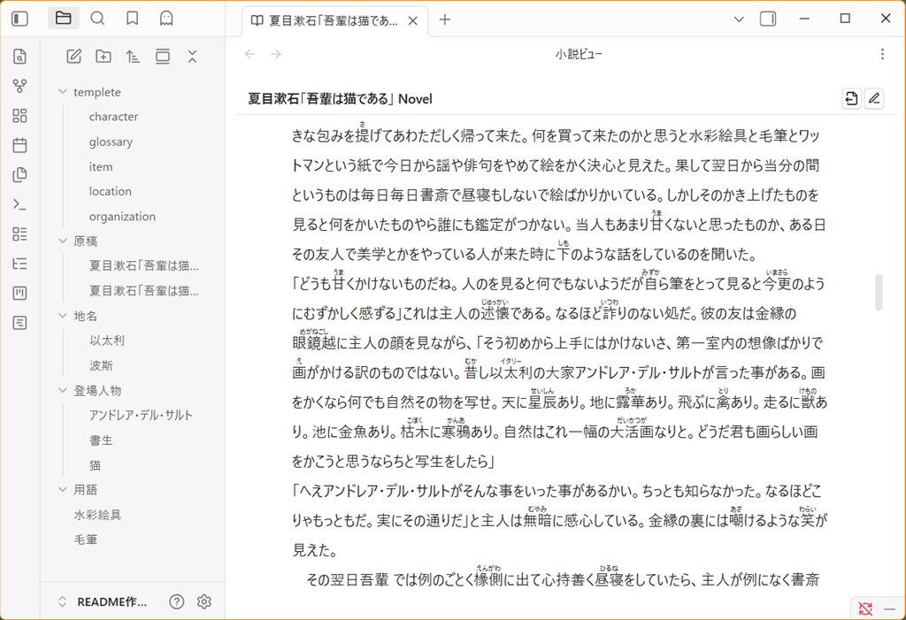

---

## 5. 原稿 Export

投稿サイト向けにテキスト整形して Export できます。
小説ビューページの右上にある　　アイコンをクリック、もしくはコマンド`現在のファイルを原稿 Export する`を実行する。

### 対応形式

- `.txt`
- `.md`

### 除去対象

- Frontmatter
- Markdown 装飾
- WikiLink
- コメント
- コードブロック
- Callout
- タグ（`#タグ名` 形式）


---


# オプション設定


## 1. 小説向けエディタ調整

### 調整可能項目

- フォントサイズ
- 行間
- 折り返し文字数

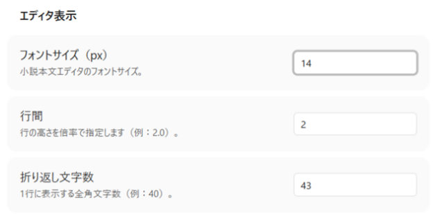

---

### ガイドライン表示

折り返し位置へガイドラインを表示できます。

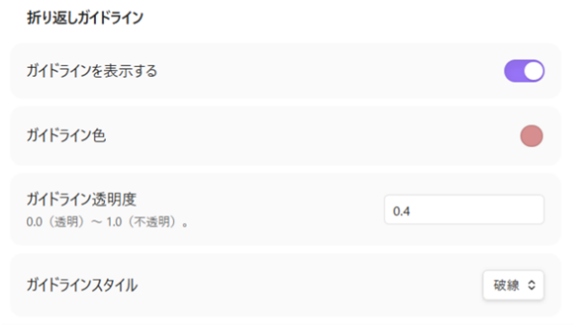

---

## 2. ルビ設定

複数のルビ形式に対応しています。

| 形式        | 記法               |
| ----------- | ------------------ |
| なろう式    | `｜漢字《ルビ》`   |
| 青空文庫式  | `漢字《ルビ》`     |
| でんでん式  | `{漢字\|ルビ}`     |
| HTML        | `<ruby>`           |

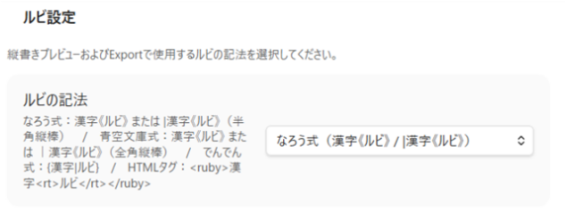

> ルビ設定は、縦書きプレビュー・小説閲覧ビューおよび Export 時の変換対象設定です。

---

## 3. 縦書きプレビュー

縦書きプレビューのハイライト表示の ON/OFF と配色を設定できます。


---

## 4. 全角スペース可視化

段落先頭の全角スペースを視覚化できます。

### 表示モード

- Dot
- Underline
- Box

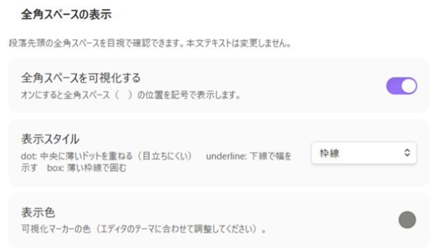

本文データ自体は変更されません。

---

## 5. 文字数カウント

### カウント方式

| モード       | 内容                    |
| ------------ | ----------------------- |
| raw          | 実文字数                |
| novel        | 全角=1 / 半角=0.5       |
| manuscript   | 原稿用紙換算            |

Markdown 記法などは自動除外されます。

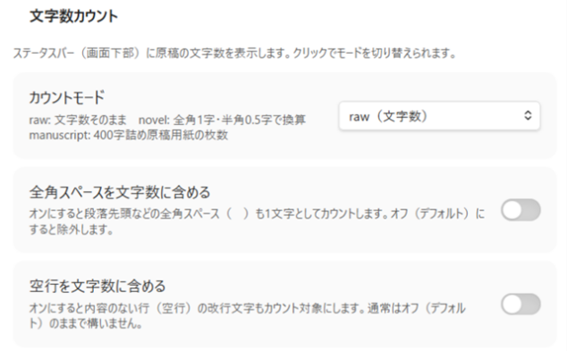

---

### 用語インデックス除外フォルダ

テンプレート用フォルダなどを、インデックスの検索対象外に設定できます。

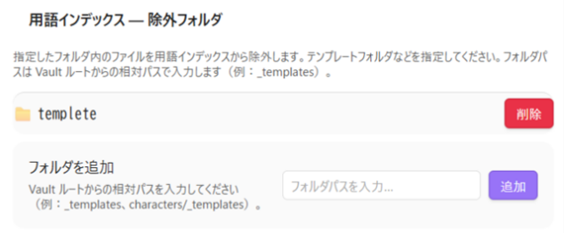

---

## 6. ハイライト

ハイライト機能の ON/OFF を設定できます。


---

### 用語ハイライト

Frontmatter のタグを持つノートを自動索引化し、本文中に登場した単語をハイライト表示します。

#### 初期タグ

| タグ              | 用途         |
| ----------------- | ------------ |
| `#character`      | キャラクター |
| `#location`       | 場所         |
| `#glossary`       | 用語         |
| `#organization`   | 組織         |
| `#item`           | アイテム     |

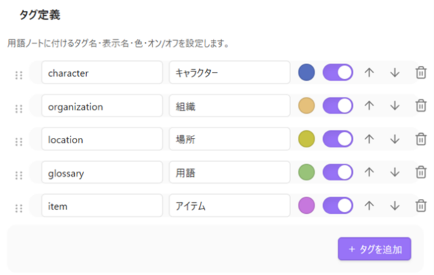

* タグ名・表示名・配色・ハイライトのON/OFFをオプションにて任意で設定できます。
* 設定画面に表示されている順番で、用語リストに表示されます。

---


### 用語インデックス

リボンアイコン　　をクリックすると、右サイドバーに用語の一覧を表示します。

#### 対応機能

- フォルダ階層表示
- タグ別分類
- 検索フィルタ
- 開閉状態保持
- ノートジャンプ

---

### カッコハイライト

日本語小説で頻出する会話記号を視覚強調します。

| 種類           | 記号 |
| -------------- | ---- |
| 鍵カッコ       | 「」 |
| 二重鍵カッコ   | 『』 |
| 丸カッコ       | （） |
| 隅付きカッコ   | 【】 |
| 山カッコ       | 〈〉 |
| 二重山カッコ   | 《》 |

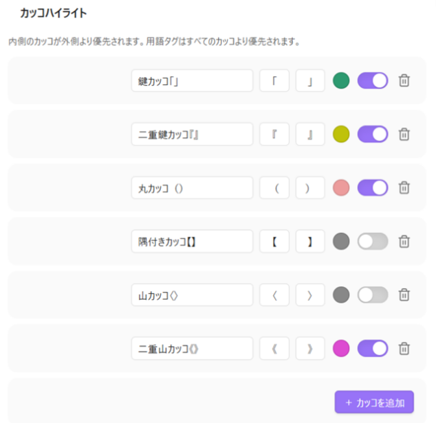

---

# コマンド一覧

| コマンド                       | 内容                 |
| ------------------------------ | -------------------- |
| 縦書きプレビューを開く         | 縦書きビュー表示     |
| 小説閲覧ビューを開く           | 横書き清書ビュー表示 |
| 現在のファイルを原稿 Export する | 投稿向け整形出力   |

---

# アイコン

| アイコン           | 機能                   |
| ------------------ | ---------------------- |
|           | タグ情報一覧を開く     |
|       | 縦書きプレビューを開く |
|  | 小説用ビューで表示     |
|  | 原稿をエクスポート     |

---

# 想定用途

- Web小説執筆
- ライトノベル執筆
- 長編小説管理
- キャラクター辞典管理
- 世界観資料管理
- 用語集管理
- 投稿前整形

---

# 対応ファイル

- `.md`
- `.txt`

---

## 更新履歴

| 日時         | バージョン | 内容                                                                                                                                                                                                                    |
| ---- | ---- | ---- |
| 2026/06/07 | v0.3.1 | ・用語一覧の検索ボックスに入力クリアボタンを設置<br>・小説用ビューにエクスポートボタンを設置 |
| 2026/06/05   | v0.3.0     | ・小説用ビュー機能を追加。※`Frontmatter`に`mode: novel`を指定したファイルが対象<br> ・`Frontmatter`が入ることによって、縦書きプレビューの表示位置とハイライトがズレるバグを修正<br> ・縦書きプレビューで二文字分字下げされるバグを修正 |
| 2026/05/30   | v0.2.1     | ・縦書きプレビューの選択ハイライトを修正<br> ・縦書きプレビューにて、区切り線`---`を文字として表示するように修正<br>・タグ情報の一覧表示を微調整<br>・タグ情報一覧の`すべて折りたたむ`を修正<br>・エクスポート時のタグ排除機能を修正<br>・リボンアイコンを変更 |
| 2026/05/27   | v0.2.0     | ・タグ定義の順番を変更できるように修正。   これにより、用語リストに表示する順番を変えることができます。|
| 2026/05/26   | v0.1.0     | ・Obsidian プラグイン Novels Note JP 公開 |

---

# ライセンス

MIT License
