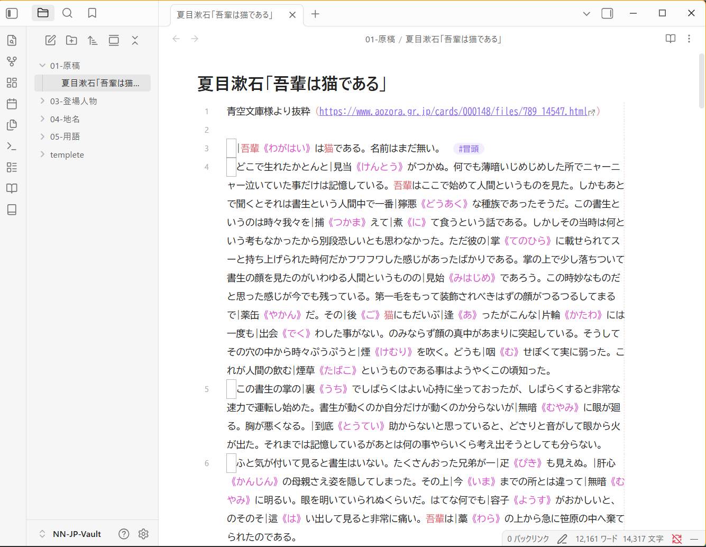
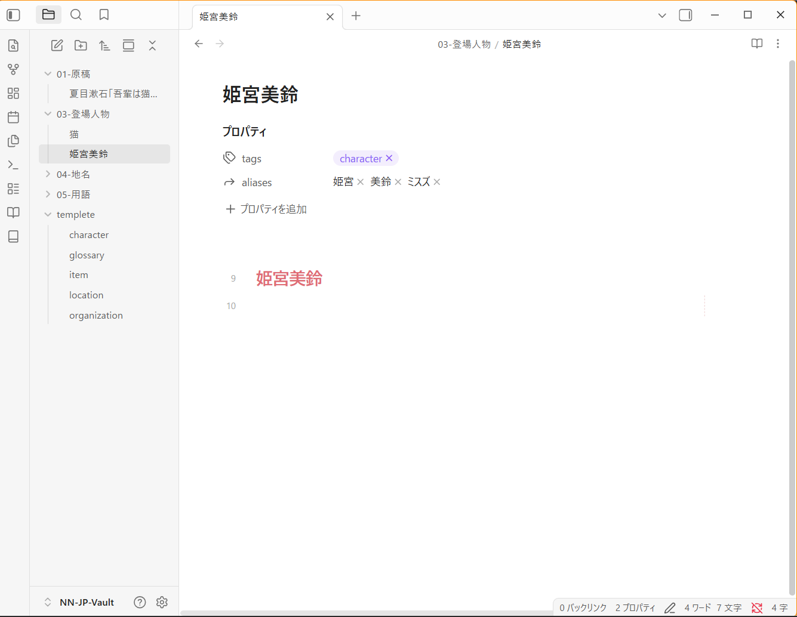
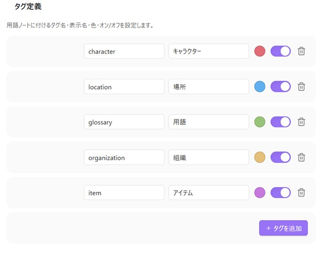
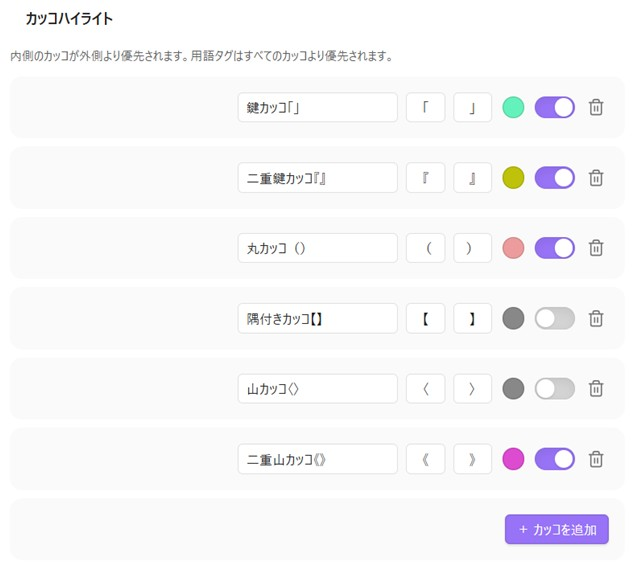
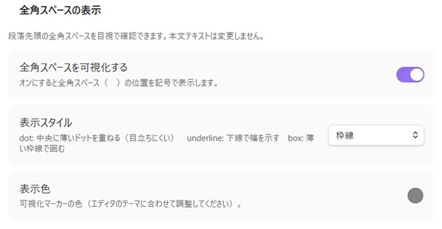
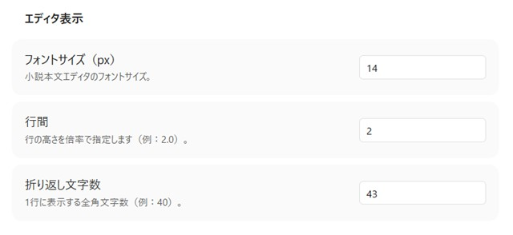
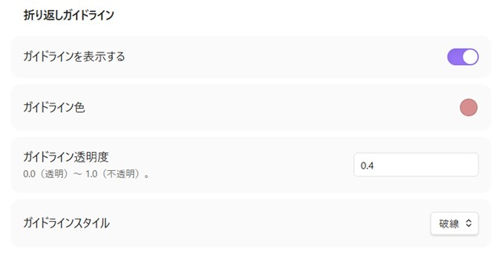
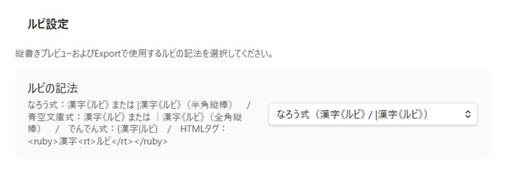
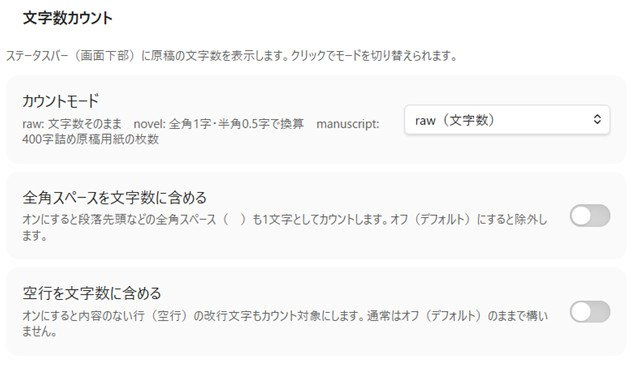
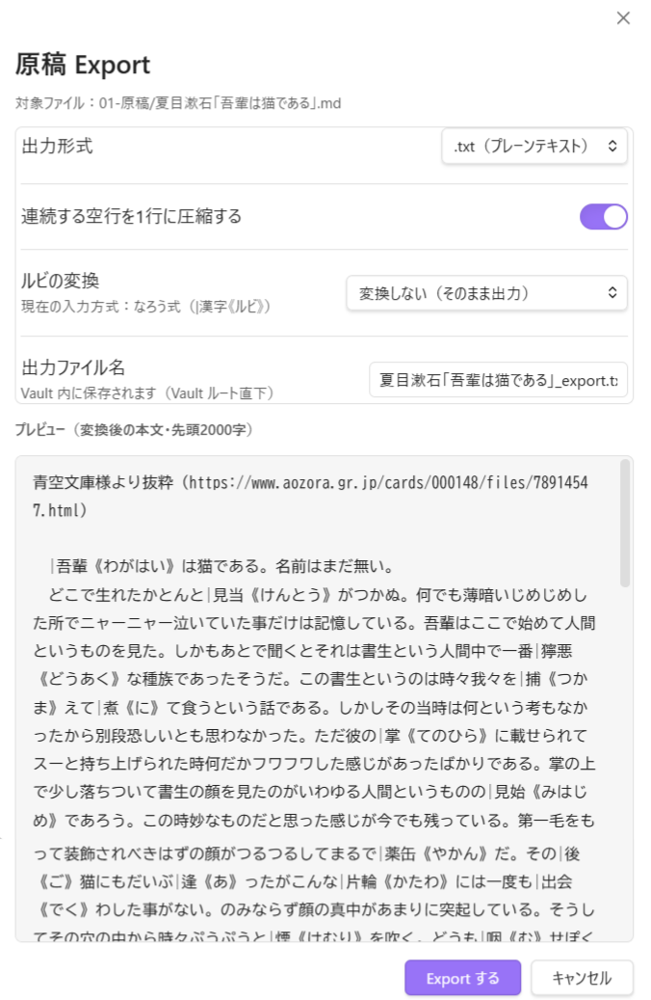

# Novels Note JP


> 日本語小説執筆に特化した  Obsidian 用 統合執筆支援プラグイン
> 縦書き・ルビ・用語管理・原稿 Export まで、日本語小説執筆に必要な機能を統合。


---

# 概要

Novels Note JP は、日本語 Web小説・ライトノベル・長編小説執筆向けに設計された  Obsidian プラグインです。
Markdown の自由さと Obsidian の知識管理能力を維持したまま、

- 小説向けエディタ最適化
- 用語・人物管理
- 日本語縦書き
- ルビ
- 原稿整形
- 小説向け文字数カウント

などを統合し、 Obsidian を「日本語小説執筆環境」として拡張します。

---

# スクリーンショット

## エディタ

- 用語ハイライト
- カッコ強調
- 全角スペース可視化
- 小説向け行幅



---

## 縦書きプレビュー


縦書きプレビューは、エディタのカーソル位置を把握して自動でスクロールします。

---

# 特徴

## 日本語小説向けに最適化

一般的な Markdown エディタでは扱いづらい、

- 日本語ルビ
- 縦書き
- 会話カッコ
- 全角スペース
- 原稿用紙換算文字数

などを、執筆時点から自然に扱えます。

---

## Obsidian の機能をそのまま活用

- WikiLink
- Tags
- Backlinks
- Graph View
- Vault 管理

など、Obsidian 本来の知識管理機能を維持したまま、小説執筆へ特化できます。

---

# 主な機能

| 機能 | 内容 |
|---|---|
| 用語ハイライト | 登場人物・組織・用語を自動強調 |
| 用語インデックス | 用語一覧をサイドバー表示 |
| カッコハイライト | 会話記号を視覚強調 |
| 全角スペース可視化 | 段落確認を容易化 |
| 縦書きプレビュー | 日本語向け、縦書き表示 |
| ルビ対応 | なろう式 / 青空文庫式 等 |
| 小説向け文字数カウント | 原稿用紙換算対応 |
| 原稿 Export | 投稿サイト向け整形 |
| エディタ最適化 | 行幅・行間・ガイドライン調整 |

---

# インストール

## Community Plugins

Community Plugins からの配布予定はありません。

---

## 手動インストール

```bash
git clone https://github.com/p77-don/novels-note-jp
```

ビルド後、以下へ配置してください。

```text
Vault/.obsidian/plugins/novels-note-jp
```

---

# クイックスタート

# 1. 用語ノートを作成

```md
---
tags:
  - character
aliases:
  - ミスズ
  - 姫宮
---

# 姫宮美鈴
```



## テンプレートのサンプル

`.obsidian/plugins/novels-note-jp/templete/` にテンプレートのサンプルが用意してあります。
`.obsidian` フォルダ内はテンプレートの対象外なので `vault root ` 以下にコピーして使用してください。

---

# 2. 原稿を書く

```md
　姫宮美鈴は静かに振り返った。
```

↓

`姫宮美鈴` が自動ハイライトされます。

---

# 機能詳細

# 用語ハイライト

Frontmatter のタグを持つノートを自動索引化し、本文中に登場した単語をハイライト表示します。

## 初期タグ

| タグ | 用途 |
|---|---|
| `#character` | キャラクター |
| `#location` | 場所 |
| `#glossary` | 用語 |
| `#organization` | 組織 |
| `#item` | アイテム |



---

## aliases 対応

```yaml
---
aliases:
  - 姫宮
  - 美鈴
---
```

ファイル名と aliases の両方を検出可能です。

---

## 用語インデックス除外フォルダ

テンプレート用フォルダなどを、インデックスの検索対象外に設定できます。


---

# 用語インデックス

用語を専用サイドバーに一覧表示します。

## 対応機能

- フォルダ階層表示
- タグ別分類
- 検索フィルタ
- 開閉状態保持
- ノートジャンプ

---

# カッコハイライト

日本語小説で頻出する会話記号を視覚強調します。

| 種類 | 記号 |
|---|---|
| 鍵カッコ | 「」 |
| 二重鍵カッコ | 『』 |
| 丸カッコ | （） |
| 隅付きカッコ | 【】 |
| 山カッコ | 〈〉 |
| 二重山カッコ | 《》 |



---

# 全角スペース可視化

段落先頭の全角スペースを視覚化できます。

## 表示モード

- Dot
- Underline
- Box

本文データ自体は変更されません。



---

# 小説向けエディタ調整

## 調整可能項目

- フォントサイズ
- 行間
- 折り返し文字数



---

## ガイドライン表示

折り返し位置へガイドラインを表示できます。



---

# 縦書きプレビュー

本文を日本語向け縦書きレイアウトで表示します。

## 対応

- 縦書き
- ルビ
- 日本語レイアウト

## コマンド

```text
縦書きプレビューを開く
```

---

# ルビ対応

複数のルビ形式に対応しています。

| 形式 | 記法 |
|---|---|
| なろう式 | `｜漢字《ルビ》` |
| 青空文庫式 | `漢字《ルビ》` |
| でんでん式 | `{漢字|ルビ}` |
| HTML | `<ruby>` |



> ルビ設定は、縦書きプレビューおよび Export 時の変換対象設定です。

---

# 文字数カウント

## カウント方式

| モード | 内容 |
|---|---|
| raw | 実文字数 |
| novel | 全角=1 / 半角=0.5 |
| manuscript | 原稿用紙換算 |

Markdown 記法などは自動除外されます。



---

# 原稿 Export

投稿サイト向けにテキスト整形して Export できます。

## 対応形式

- `.txt`
- `.md`

## 除去対象

- Frontmatter
- Markdown 装飾
- WikiLink
- コメント
- コードブロック
- Callout




---

## ルビ変換

- なろう式 → 青空文庫式
- HTML → なろう式
- ルビ除去

などに対応予定。

---

# コマンド一覧

| コマンド | 内容 |
|---|---|
| 縦書きプレビューを開く | 縦書きビュー表示 |
| 現在のファイルを原稿 Export する | 投稿向け整形出力 |

---

# 想定用途

- Web小説執筆
- ライトノベル執筆
- 長編小説管理
- キャラクター辞典管理
- 世界観資料管理
- 用語集管理
- 投稿前整形

---

# 対応ファイル

- `.md`
- `.txt`

---

# ライセンス

MIT License
