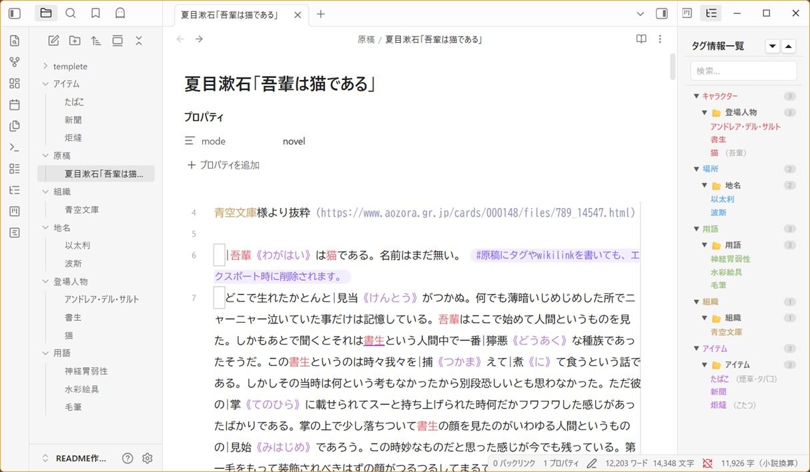
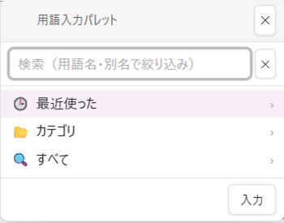
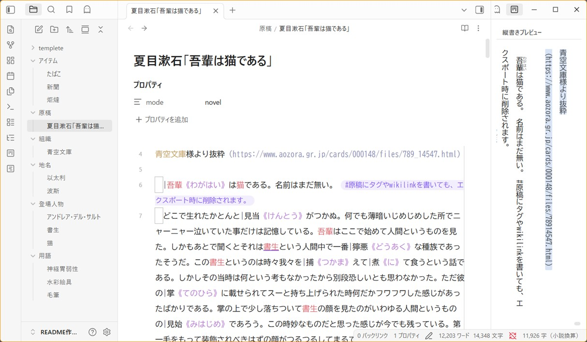
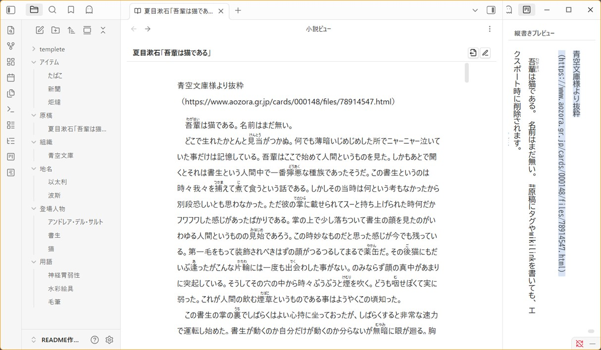
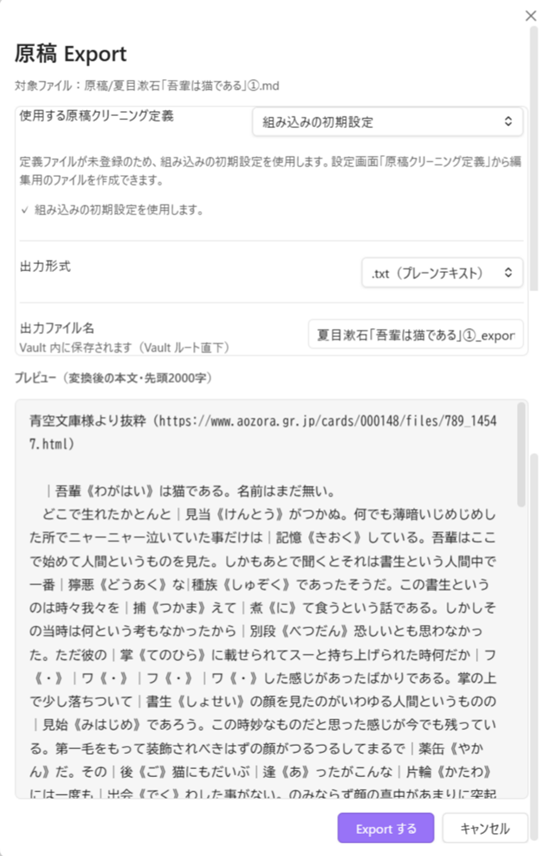
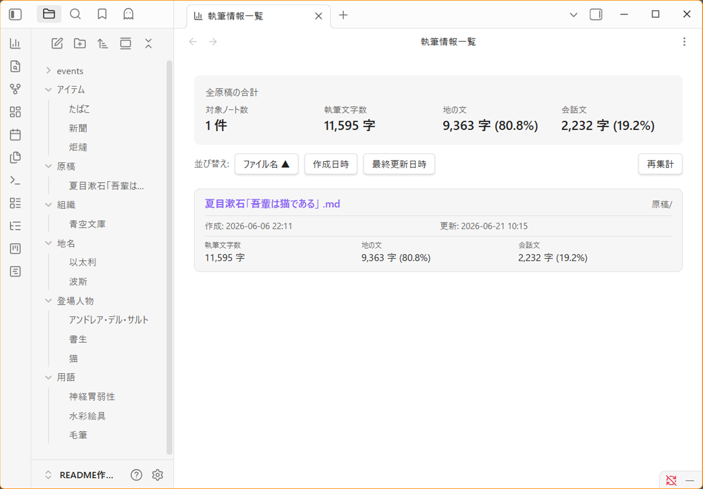

# Novels Note JP

[English](#English) | [日本語](#日本語)

---

## English

**Novels Note JP** is an editor extension plugin specialized for writing Japanese novels. It offers not only essential features like paragraph indentation and ruby ​​support, but also tools to assist with writing—such as terminology registration, input, and highlighting—as well as vertical-text previews, writing statistics, and manuscript export in specific ruby ​​formats. It supports both desktop and mobile platforms.

---

### Key Features

#### Novel Mode
Any `.md` file with `mode: novel` in its frontmatter is treated as **Novel Mode** (a manuscript), and the plugin's editor features are applied to it. Regular notes are unaffected.

```yaml
---
mode: novel
---
```

> **Note**
> Novel Mode detection is based on YAML frontmatter, but Obsidian only parses frontmatter for `.md` files. Frontmatter is not recognized in `.txt` files, so adding `mode: novel` there will not enable Novel Mode (fonts, term highlighting, bracket highlighting, ruby rendering, word count, etc. will not work). The ".txt file support" described below only covers opening/editing files and the vertical-text preview.



#### Japanese Writing Environment
- **Monospace fonts optimized for Japanese** (BIZ UDGothic, Noto Sans Mono CJK JP, etc.). Font size and line height are adjustable in settings.
- **Full-width space visualization** (to prevent accidental input mistakes). Choose from dot, underline, or border display styles.
- **Automatic paragraph indentation**
- **Configurable line-wrap width** with a visual ruler (color, opacity, and solid/dashed style are configurable)
- **`.txt` file support** — Open and edit plain text files directly, with vertical-text preview also available. Note that Novel Mode itself is not included for `.txt` files (see the note under [Novel Mode](#novel-mode) above for details).

#### Ruby (Furigana) & Emphasis Dots
Select text in the editor and right-click to see items in the context menu.

- **Add ruby** — Opens a ruby input dialog for the selected text. A preview updates in real time as you type the reading, and clicking "Insert" inserts it using the notation configured in settings.
- **Add emphasis dots** — Immediately inserts an emphasis dot ("・") above/beside each character of the selected text.

Ruby notation is also rendered inline in the editor as an HTML `<ruby>` element, so it stays readable while you write.

> **On mobile:** Since there is no way to open a right-click menu on mobile, the same functionality is provided as commands instead. Select some text, then run **Add ruby to selected text** / **Add emphasis dots to selected text** from the command palette (or from a command you've added to the mobile toolbar).

Four ruby notations are supported (switchable uniformly in settings):

| Style | Notation |
|---|---|
| Narou-style | `\|Kanji《Ruby》` (half-width vertical bar) |
| Aozora Bunko-style | `｜Kanji《Ruby》` (full-width vertical bar) |
| Denden-style | `{Kanji\|Ruby}` |
| HTML | `<ruby>Kanji<rt>Ruby</rt></ruby>` |

#### Term Highlighting
The filename (or the value of the `name` property, if set) of any note tagged with a category tag (`character`, `location`, `glossary`, `organization`, `item`) is registered as a term and highlighted in the editor. You can configure a color and an on/off toggle for each category. You can also register alternate names via `aliases`.

```yaml
---
tags: character
aliases: (register alternate names)
---
```

Hovering over a highlighted term in the editor shows the corresponding term note via Obsidian's standard Page Preview (Hover Preview).

> **On mobile:** Since hovering doesn't exist on mobile, this feature is disabled there. Instead, select the text and run the **Open term note for selected text** command to view the term note's content (a body preview) in a modal. You can also open the note directly from "Open term page" in the modal.

#### Glossary Input Palette
While writing, typing a trigger character (`/` by default) opens the glossary input palette near your cursor, letting you search and insert terms registered in the term index right there — no need to go find the term note yourself.



- The glossary input palette is **disabled** by default. To use it, turn on "Enable glossary input palette" in settings.
- The palette has its own search field for filtering.
- From three entry points — "Recent," "Category," and "All" — you can drill down through Category → Folder → Term note → Notation (filename / `name` / `aliases`) to find the notation you want.
- Term notes with only one possible notation (e.g., no `name` set) skip the notation-selection screen entirely and can be selected directly.
- The selected notation is inserted right where you are with Enter or the "Insert" button.
- "Recent" shows the most recently used term notes, in order of use (can be cleared from the settings screen).
- In addition to opening via the trigger character, you can also invoke it via the **Open glossary input palette** command from the command palette, a hotkey, or the mobile toolbar (in this case, you don't need to have typed the trigger character first).
- The scope in which the palette can be triggered is configurable: "Manuscript notes only," "Manuscript + glossary notes," or "All notes" (default: "Manuscript + glossary notes"). This helps prevent accidental activation in notes — like memos — where you often type the `/` character for other reasons.

> **On mobile:** The glossary input palette may overlap with the on-screen keyboard. Tap anywhere in the palette's empty space (outside the search field) to dismiss the keyboard.

#### Bracket Highlighting
Highlights Japanese brackets (`「」『』（）【】〈〉《》`) by type, with a configurable color and individual on/off toggle for each.

#### Term Index (Sidebar Panel)
Displays a list of terms as a folder tree in the right sidebar.

- Expandable folder hierarchy
- Search / filtering (with a clear button)
- Click to open a note
- **Right-click a category or folder** → Create a new term note in that folder
- **Right-click a term** → Open the note, insert into manuscript, copy link to clipboard, or delete (with a confirmation dialog; moves to trash)
- Drag and drop to move items within the folder hierarchy (**Note:** since this moves items between folders, you cannot drop onto a location where no folder is shown)
- Drag and drop into the main pane to insert a term (as a WikiLink)
- Tags are collapsed by default on startup
- Configurable excluded folders (via settings)

You can specify a folder path when creating a new term note. If the specified folder doesn't exist, a confirmation dialog appears before it's created.

> **On mobile:** Long-press a category or folder to open the "create new" menu (in place of right-click). Drag-and-drop of terms works for moving between folders, but inserting into the main pane (as a WikiLink into the manuscript) doesn't work due to drag-and-drop limitations on mobile. Instead, **tap a term** to open a menu where you can choose "Open note," "Insert into manuscript," or "Copy link to clipboard." "Insert into manuscript" inserts at the cursor position of the manuscript note you were most recently editing (if no manuscript is open, it's copied to the clipboard automatically instead).

#### Word Count
Displays three counting modes in the status bar (desktop only; this display is unavailable on mobile due to Obsidian's own limitations, which don't provide a status bar there).

- **Raw character count** — Total character count
- **Novel-weighted count** — Counts only body text (excludes frontmatter, tags, WikiLinks, etc.)
- **Manuscript-paper equivalent** — Converted to sheets of 400-character Japanese manuscript paper (**Note:** this is a simple character-count-based conversion, so it may differ from an actual manuscript-paper page count)

Whether to include full-width spaces, blank lines, and hashtags in the count is also configurable.

#### Vertical-Text Preview
Previews the note currently shown in the main pane in a vertical-text layout.

- Cursor position sync between the editor and the preview
- Preserves selection highlighting across ruby notation
- Cursor-line highlighting (color and on/off configurable)



> **On mobile:** On desktop, this opens in the right sidebar so you can write while checking it alongside the editor, but on mobile, due to screen size constraints, it can't be shown at the same time as the editor, so it opens as an independent tab instead. As a result, cursor position sync and cursor-line highlighting don't work on mobile. Note that the line-wrap width setting may also not fit exactly as specified, depending on your screen height.

#### Novel Reading View
A clean reading view with WikiLinks, tags, and non-body content stripped out. Shows a popup notice for files that aren't in Novel Mode. An export button sits next to the edit button.



#### Export
Exports the current note as clean manuscript text from a dedicated export dialog.

- Strips Markdown/Obsidian syntax (WikiLinks, tags, frontmatter, etc.)
- Choose the output format (`.txt` / `.md`)
- Choose how ruby notation is handled (keep as-is / convert to another style / strip and keep only the base text)
- Option to collapse consecutive blank lines into one
- Always available from the command palette
- **Never modifies the original file**



#### Writing Stats
Aggregates all `mode: novel` notes across your vault and lists them in the main pane.

- Run **Open writing stats** from the command palette to open it as a new tab.
- The top of the view shows a fixed summary across all manuscripts (word count, and the character count/ratio of narration vs. dialogue).
- Below that, a card is shown for each matching manuscript note, with its word count, narration/dialogue character count and ratio, creation date, and last-modified date.
- Dialogue detection is based on which bracket types are enabled in your bracket-highlighting settings (「」『』, etc.).
- Sortable by filename, creation date, or last-modified date. When sorting, only the list of manuscripts scrolls — the summary and sort buttons stay fixed in place.
- Click a filename to open that note directly.
- The **Recalculate** button refreshes the view with the latest data at any time (this button isn't shown on mobile).
- You can specify folders to exclude from aggregation in settings (managed separately from the term index's excluded folders).



---

### Installation

#### From Community Plugins (recommended)
1. Open **Settings** → **Community plugins** → **Browse**
2. Search for **Novels Note JP**
3. **Install** → **Enable**

The same steps work in the mobile app.

#### Manual Installation
1. Download `main.js`, `manifest.json`, and `styles.css` from the [latest release](https://github.com/p77-don/novels-note-jp/releases)
2. Copy them into your vault's plugin folder: `<vault>/.obsidian/plugins/novels-note-jp/`
3. Restart Obsidian and enable the plugin under **Settings** → **Community plugins**

---

### Basic Usage

1. Enable the plugin.
2. Add `mode: novel` to the frontmatter of any note you want to use as a manuscript.
3. Configure highlight colors, ruby style, term categories, etc. under **Settings** → **Novels Note JP**.

#### Adding Ruby / Emphasis Dots
**Desktop:**
1. Select the text you want to add ruby to in the editor.
2. Right-click to open the context menu.
3. Choose **Add ruby**, enter the reading in the dialog, and click "Insert."
4. Or choose **Add emphasis dots** to apply emphasis dots instantly.

**Mobile:**
1. Select the text you want to add ruby to in the editor.
2. Run **Add ruby to selected text** / **Add emphasis dots to selected text** from the command palette, or from a customized mobile toolbar.

#### Defining Terms
Create notes for characters, locations, terminology, etc., and assign the corresponding category tag:

| Tag | Category |
|---|---|
| `character` | Character names |
| `location` | Place names |
| `glossary` | Terminology / worldbuilding |
| `organization` | Organizations / groups |
| `item` | Items / objects |

The note's filename (or the value of its `name` property, if set) is registered as a term and automatically highlighted in Novel Mode editors. Five categories are provided by default, but you're free to add or remove categories as you like.

#### Using the Glossary Input Palette
While writing, typing the trigger character (`/` by default) opens the glossary input palette near your cursor. Type a term name or alias into the search field, or browse via "Recent," "Category," or "All" to find the term you want, then insert it into the manuscript with Enter or the "Insert" button. You can cancel at any time with Escape, or (on mobile) the modal's close button.

If you'd rather invoke it without typing the trigger character, run **Open glossary input palette** from the command palette, or assign a hotkey to it. On mobile, you can also register this action as a mobile toolbar button.

The scope in which the palette can be triggered, the trigger character, and clearing the "Recent" history can all be changed under **Settings** → **Novels Note JP** → "Glossary input palette."

#### Vertical-Text Preview
Run **Novels Note JP: Open vertical preview** from the command palette (`Ctrl/Cmd + P`). It opens in the right sidebar on desktop, or as a new tab on mobile.

#### Novel Reading View
Run **Novels Note JP: Open novel reading view** from the command palette to switch the current note to the novel reading view.

#### Export
Run **Novels Note JP: Export current file as manuscript** from the command palette.

#### Writing Stats
Run **Novels Note JP: Open writing stats** from the command palette to open the manuscript aggregation view as a new tab.

---

### Settings Reference

| Setting | Description |
|---|---|
| Font size | Font size used in Novel Mode editors |
| Line height | Line height used in Novel Mode editors |
| Line-wrap width | Number of full-width characters per line |
| Show wrap guideline | Show/hide the line-wrap ruler (color, opacity, solid/dashed) |
| Ruby notation | The notation used for ruby input, inline rendering, and export (Narou-style / Aozora Bunko-style / Denden-style / HTML) |
| Vertical preview cursor highlight | Cursor line background color and on/off (not adjustable on mobile) |
| Full-width space & line-break marker visibility | Show/hide toggle, plus style (dot / underline / border) and color |
| Word count mode | Raw character count / Novel-weighted count / Manuscript-paper equivalent (desktop only) |
| Word count options | Whether to include full-width spaces, blank lines, and hashtags in the count |
| Term index excluded folders | Folders excluded from the term index |
| Writing stats excluded folders | Folders excluded from writing-stats aggregation (managed separately from the term index's excluded folders) |
| Term highlighting: master toggle | Turns all highlighting features on/off at once |
| Term category colors & toggles | Color and on/off for each term category |
| Bracket colors & toggles | Color and on/off for each bracket type |
| Glossary palette: enable | Turns the entire glossary input palette feature on/off |
| Glossary palette: scope | Where the palette can be triggered (Manuscript notes only / Manuscript + glossary notes / All notes) |
| Glossary palette: trigger character | The character that opens the palette (default: `/`) |
| Glossary palette: clear history | Deletes the entire "Recent" history (with a confirmation dialog) |

---

### About Mobile Support

As of version 0.9.0, this plugin supports the mobile versions of Obsidian.Core writing, highlighting, ruby, export, and term-management features work the same as on desktop, but due to mobile-specific constraints, some features work differently or aren't available. See the "On mobile:" notes within each feature section above for details.

- Features that rely on right-click or mouse hover are replaced with commands or tap menus.
- Features that can't be implemented within Obsidian mobile's screen layout — such as the status-bar word count, and vertical-preview cursor sync/cursor highlighting — are not supported.
- Both the glossary input palette and the "create new term note" dialog are shown as standard Obsidian modals anchored to the top of the screen, so neither is hidden behind the on-screen keyboard.
- So far, this plugin has only been tested on a physical iOS device; behavior on Android, tablets, and foldable phones is unverified. If you find any issues, please report them via [Issues](https://github.com/p77-don/novels-note-jp/issues).

---

### Requirements

- Obsidian v1.8.7 or later
- Supports desktop and mobile

---


## 日本語

**Novels Note JP**は日本語小説の執筆に特化したエディタ拡張系プラグインです。執筆に欠かせない先頭字下げやルビ機能だけでなく、執筆を補助するための用語の登録・入力・ハイライト機能、原稿を確認するための縦書きプレビューや執筆情報の表示機能、指定ルビ形式での原稿エクスポート機能も提供しています。デスクトップ・モバイルの両方に対応しています。

---

### 主な機能

#### ノベルモード
フロントマターに `mode: novel` を記載した`.md`ファイルが**ノベルモード**（原稿）として扱われ、プラグインのエディタ機能が適用されます。通常のノートには影響を与えません。

```yaml
---
mode: novel
---
```

> **注意**
> ノベルモードの判定は YAML フロントマターに基づいていますが、Obsidian はフロントマターを `.md` ファイルに対してのみ解析します。`.txt` ファイルではフロントマターが認識されないため、`mode: novel` を記載してもノベルモードは有効になりません（フォント・用語ハイライト・括弧ハイライト・ルビ表示・文字数カウントなどの機能は動作しません）。後述する「`.txt` ファイル対応」は、あくまでもファイルの開閉・編集と縦書きプレビューのみを対象としています。


#### 日本語執筆環境
- **日本語向けに最適化された等幅フォント**（BIZ UDゴシック、Noto Sans Mono CJK JP など）。フォントサイズと行間は設定で調整可能
- **全角スペースの可視化**（誤入力を防止）。表示スタイルはドット・下線・ボーダーから選択可能
- **段落自動字下げ**
- **折り返し桁数の設定**とビジュアル定規（色・不透明度・実線/破線を設定可能）
- **`.txt` ファイル対応** — プレーンテキストファイルを直接開いて編集でき、縦書きプレビューも利用可能です。ただし、ノベルモード自体は含まれません（詳細は上記[ノベルモード](#ノベルモード)の注意書きを参照）

#### ルビ・傍点の入力
エディタ上で文字列を選択して右クリックすると、コンテキストメニューに項目が表示されます。

- **ルビを振る** — 選択した文字列に対してルビ入力ダイアログが開きます。読み仮名を入力するとリアルタイムで プレビューが更新され、「挿入」ボタンで設定のルビ方式に従った記法で挿入されます。
- **傍点を振る** — 選択した文字列の各文字に対して「・」を傍点として即座に挿入します。

ルビ記法はエディタ上でも HTML の `<ruby>` 要素としてインラインレンダリングされるため、執筆中も読みやすい表示で確認できます。

> **モバイルでは：** モバイル環境には右クリックメニューを開く手段がないため、同じ機能をコマンドとして提供しています。文字列を選択したうえで、コマンドパレット（または`モバイルツールバー`に登録したコマンド）から `選択した文字列にルビを振る` /`選択した文字列に傍点を振る` を実行してください。

対応しているルビ記法は以下の4種類です（設定で統一的に切り替え可能）：

| 方式 | 記法 |
|---|---|
| なろう式 | `\|漢字《ルビ》`（半角縦棒） |
| 青空文庫式 | `｜漢字《ルビ》`（全角縦棒） |
| でんでん式 | `{漢字\|ルビ}` |
| HTML | `<ruby>漢字<rt>ルビ</rt></ruby>` |

#### 用語ハイライト
カテゴリタグ（`character`、`location`、`glossary`、`organization`、`item`）が付いたノートのファイル名（または `name` プロパティの値）が用語として登録され、エディタ上でハイライト表示します。カテゴリごとに色と表示のオン/オフを設定できます。また、`aliases` にて別名を登録することもできます。

```yaml
---
tags: character
aliases: （別名を登録）
---
```

エディタ上でハイライトされた用語にマウスを合わせると、対応する用語ノートを Obsidian 標準のページプレビュー（Hover Preview）で確認できます。

> **モバイルでは：** ホバー（マウスを合わせる操作）自体が存在しないため、この機能はモバイルでは無効になります。代わりに、文字列を選択して **選択した文字列の用語ノートを開く** コマンドを実行すると、用語ノートの内容（本文プレビュー）をモーダル表示で確認できます。モーダルの「用語ページを開く」からノートを直接開くことが可能です。

#### 用語入力パレット
執筆中にトリガー文字（デフォルトは `/`）を入力すると、カーソル位置の近くに用語入力パレットが表示され、用語インデックスに登録されている用語をその場で検索・入力できます。用語インデックスを開かなくても入力できます。


- 用語入力パレットはデフォルトでは`無効`になっています。使用する場合は「用語入力パレットを有効にする」をオンにしてください。
- パレット自身に検索欄を備えており、絞り込み検索が可能です。
- 「最近使った」「カテゴリ」「すべて」の3つの入口から、カテゴリ → フォルダ → 用語ノート → 表記（ファイル名 / `name` / `aliases`）という階層をたどって目的の表記を選べます
- 表記候補が1つしかない用語ノート（`name` を設定していない等）は、表記選択の画面を経由せず直接選べます
- 選択した表記は Enter または「入力」ボタンでその場に挿入されます
- 「最近使った」には、直近で入力した用語ノートが使用した順に表示されます（設定画面からクリア可能）
- トリガー文字での起動のほか、コマンドパレット・ホットキー・モバイルツールバーから **用語入力パレットを起動** コマンドでも呼び出せます（この場合、直前にトリガー文字を入力しておく必要はありません）
- 起動できる範囲は設定で「原稿ノートのみ」「原稿ノート＋用語ノート」「すべてのノート」から選択できます（デフォルトは「原稿ノート＋用語ノート」）。メモなど、日常的に キー文字「`/`」 を書く機会が多いノートで誤って起動してしまうのを防げます

> **モバイルでは：** 用語入力パレットとソフトウェアキーボードが重なって表示される場合があります。用語入力パレットの余白部分（検索欄以外）をタップすることでソフトウェアキーボードを閉じることができます。

#### 括弧ハイライト
日本語括弧（`「」『』（）【】〈〉《》`）を種類ごとに色設定・個別トグルでハイライト表示します。

#### 用語インデックス（サイドバーパネル）
右サイドバーに用語の一覧をフォルダツリー形式で表示します。

- フォルダ階層の展開表示
- 検索・フィルタリング（クリアボタン付き）
- クリックでノートを開く
- **カテゴリ・フォルダを右クリック** → そのフォルダに用語ノートを新規作成
- **用語を右クリック** → ノートを開く・原稿に挿入・リンクをクリップボードへコピー・削除（確認ダイアログ付き、ゴミ箱へ移動）
- ドラッグ＆ドロップでフォルダ階層を移動（ **注意：** フォルダ間移動なので、フォルダが表示されていない場所へは移動できません）
- ドラッグ＆ドロップでメインペインに用語を挿入（WikiLink 形式）
- 起動時はタグを折りたたんだ状態で表示
- 除外フォルダの設定（オプションにて設定）

用語ノートの新規作成時にフォルダパスを指定できます。指定したフォルダが存在しない場合、作成前に確認ダイアログが表示されます。

> **モバイルでは：** カテゴリ・フォルダの長押しで新規作成メニューが開きます（右クリックの代わり）。用語のドラッグ＆ドロップは、フォルダ間の移動には対応していますが、メインペインへの挿入（原稿へのWikiLink挿入）はモバイル環境のドラッグ＆ドロップの制約により動作しません。代わりに、**用語をタップ**するとメニューが開き、「ノートを開く」「原稿に挿入」「リンクをクリップボードへコピー」を選択できます。「原稿に挿入」は、直前まで編集していた原稿ノートのカーソル位置に挿入されます（原稿を開いていない場合は自動的にクリップボードへコピーされます）。

#### 文字数カウント
3つのカウントモードをステータスバーに表示します（デスクトップ版のみ。モバイルでは Obsidian 側の仕様によりステータスバーが利用できないため、この表示はありません）。

- **生文字数** — 総文字数
- **小説用重み付き** — 本文のみをカウント（フロントマター・タグ・WikiLink 等を除外）
- **原稿用紙換算** — 400字詰め原稿用紙換算枚数（ **注意：** 単純な文字数での換算なので、実際の原稿用紙枚数とは乖離があります）

全角スペース・空行・ハッシュタグをカウントに含めるかどうかもオプションで設定できます。

#### 縦書きプレビュー
メインペインに表示されているノートを縦書きレイアウトでプレビューします。

- エディタとプレビュー間のカーソル位置同期
- ルビ表記をまたいだ選択範囲のハイライト保持
- カーソル行ハイライト（色とオン/オフを設定可能）


> **モバイルでは：** デスクトップでは右サイドバーに開き、エディタと並べて確認しながら執筆できますが、モバイルでは画面の制約上エディタと同時に表示できないため、独立したタブとして開きます。これに伴い、カーソル位置同期・カーソル行ハイライトはモバイルでは動作しません。折り返し桁数の設定も、画面の高さによっては指定した文字数どおりに収まらない場合があるので注意してください。

#### 小説閲覧ビュー
WikiLink・タグ・本文以外のコンテンツを除去したクリーンな閲覧ビューです。ノベルモードでないファイルにはポップアップで通知します。編集ボタンの隣にエクスポートボタンも配置されています。


#### エクスポート
専用のエクスポートダイアログから、現在のノートをクリーンな原稿テキストとして出力します。

- Markdown・Obsidian 記法（WikiLink、タグ、フロントマターなど）を除去
- 出力形式（`.txt` / `.md`）を選択可能
- ルビ記法の扱いを選択可能（保持／他方式へ変換 / 親文字のみ残して除去）
- 連続する空行を1行に圧縮するオプション
- コマンドパレットから常に実行可能
- **元のファイルは一切変更されません**


#### 執筆情報一覧
Vault 全体の `mode: novel` ノートを集計し、メインペインに一覧表示します。

- コマンドパレットから **執筆情報一覧を開く** を実行すると、新規タブとして開きます。
- 上部には全原稿の合計（執筆文字数・地の文・会話文の文字数と比率）が固定表示されます。
- その下に、該当する原稿ノートごとのカードが並び、執筆文字数・地の文／会話文の文字数と比率・作成日時・最終更新日時を表示します。
- 会話文の判定は、括弧ハイライト設定で有効になっている括弧の種類（「」『』など）に基づきます。
- ファイル名・作成日時・最終更新日時で並び替え可能。並び替え時にスクロールするのは原稿の一覧部分のみで、合計サマリーと並び替えボタンは常に表示され続けます。
- ファイル名をクリックすると、そのノートを直接開けます。
- **再集計** ボタンでいつでも最新の状態に更新できます（モバイルではこのボタンは表示されません）。
- 設定にて、集計対象から除外するフォルダを指定可能（用語インデックスの除外フォルダとは別に管理されます）。


---

### インストール

#### コミュニティプラグインから（推奨）
1. **設定** → **コミュニティプラグイン** → **閲覧** を開く
2. **Novels Note JP** を検索
3. **インストール** → **有効化**

モバイル版アプリでも同じ手順でインストールできます。

#### 手動インストール
1. [最新リリース](https://github.com/p77-don/novels-note-jp/releases)から `main.js`、`manifest.json`、`styles.css` をダウンロード
2. Vault のプラグインフォルダへコピー：`<vault>/.obsidian/plugins/novels-note-jp/`
3. Obsidian を再起動し、**設定** → **コミュニティプラグイン** でプラグインを有効化

---

### 基本的な使い方

1. プラグインを有効化する
2. 原稿として使用したいノートのフロントマターに `mode: novel` を記入する。
3. **設定** → **Novels Note JP** でハイライト色・ルビ方式・用語カテゴリなどを設定する。

#### ルビ・傍点の入力
**デスクトップ：**
1. エディタでルビを付けたい文字列を選択する。
2. 右クリックしてコンテキストメニューを開く。
3. **ルビを振る** を選択してダイアログで読み仮名を入力し、「挿入」をクリック。
4. または **傍点を振る** を選択して即座に傍点を適用する。

**モバイル：**
1. エディタでルビを付けたい文字列を選択する。
2. コマンドパレット、またはカスタマイズしたモバイルツールバーから **選択した文字列にルビを振る** / **選択した文字列に傍点を振る** を実行する

#### 用語の定義
登場人物・場所・用語などのノートを作成し、対応するカテゴリタグを付与します：

| タグ | カテゴリ |
|---|---|
| `character` | 人物名 |
| `location` | 場所名 |
| `glossary` | 用語・世界観設定 |
| `organization` | 組織・団体 |
| `item` | アイテム・道具 |

ノートのファイル名（または `name` プロパティを設定している場合はその値）が用語として登録され、ノベルモードのエディタで自動的にハイライトされます。 また、デフォルトで５つのカテゴリを用意してありますが、自由に追加・削除ができます。

#### 用語入力パレットの使用
執筆中にトリガー文字（デフォルト `/`）を入力すると、カーソル付近に用語入力パレットが開きます。検索欄に用語名や別名を入力するか、「最近使った」「カテゴリ」「すべて」から目的の用語をたどり、Enter または「入力」ボタンで本文に挿入します。Escape、または（モバイルでは）モーダルの閉じるボタンでいつでも中断できます。

トリガー文字を打たずに呼び出したい場合は、コマンドパレットから **用語入力パレットを起動** を実行するか、任意のホットキーを割り当てて使用してください。モバイルでは、この操作をモバイルツールバーのボタンとして登録することができます。

起動できる範囲、トリガー文字、「最近使った」履歴のクリアは、**設定** → **Novels Note JP** → 「用語入力パレット」から変更できます。

#### 縦書きプレビュー
コマンドパレット（`Ctrl/Cmd + P`）から **Novels Note JP: 縦書きプレビューを開く** を実行します。デスクトップでは右サイドバー、モバイルでは新規タブとして開きます。

#### 小説閲覧ビュー
コマンドパレットから **Novels Note JP: 小説閲覧ビューを開く** を実行すると、現在のノートを小説閲覧ビューに切り替えます。

#### エクスポート
コマンドパレットから **Novels Note JP: 現在のファイルを原稿 Export する** を実行します。

#### 執筆情報一覧
コマンドパレットから **Novels Note JP: 執筆情報一覧を開く** を実行すると、原稿の集計一覧が新規タブとして開きます。

---

### 設定一覧

| 設定項目 | 説明 |
|---|---|
| フォントサイズ | ノベルモードのエディタで使用するフォントサイズ |
| 行間 | ノベルモードのエディタで使用する行間 |
| 折り返し桁数 | 1行あたりの全角文字数 |
| 折り返しガイドラインの表示 | 折り返し位置の定規の表示/非表示（色・不透明度・実線/破線） |
| ルビ設定 | ルビ入力・インラインレンダリング・エクスポートに使用する記法（なろう式 / 青空文庫式 / でんでん式 / HTML） |
| 縦書きプレビューのカーソルハイライト | カーソル行の背景色とオン/オフ（モバイルでは操作不可） |
| 全角スペースと改行記号の可視化 | 表示/非表示の切り替えと、スタイル（ドット・下線・ボーダー）・色の設定 |
| 文字数カウントモード | 生文字数 / 小説用重み付き / 原稿用紙換算（デスクトップのみ表示） |
| 文字数カウントオプション | 全角スペース・空行・ハッシュタグをカウントに含めるか |
| 用語インデックス 除外フォルダ | 用語インデックスから除外するフォルダ |
| 執筆情報一覧 除外フォルダ | 執筆情報一覧の集計対象から除外するフォルダ（用語インデックスの除外フォルダとは別に管理） |
| 用語ハイライト：全体トグル | すべてのハイライト機能の一括オン/オフ |
| 用語カテゴリカラー・トグル | 用語カテゴリごとの色とオン/オフ |
| 括弧カラー・トグル | 括弧の種類ごとの色とオン/オフ |
| 用語入力パレット：有効化 | 用語入力パレット機能全体のオン/オフ |
| 用語入力パレット：起動範囲 | パレットを起動できる範囲（原稿ノートのみ / 原稿ノート＋用語ノート / すべてのノート） |
| 用語入力パレット：トリガー文字 | パレットを開くトリガー文字（デフォルト `/`） |
| 用語入力パレット：履歴クリア | 「最近使った」の履歴をすべて削除（確認ダイアログあり） |

---

### モバイル対応について

バージョン 0.9.0 より、モバイル版 Obsidian に対応しました。基本的な執筆・ハイライト・ルビ・エクスポート・用語管理機能はデスクトップと同様に利用できますが、モバイル特有の制約により、一部の機能は操作方法が異なる、または利用できません。詳細は各機能セクション内の「モバイルでは：」の記載を参照してください。

- 右クリック・マウスホバーに依存する機能は、コマンドまたはタップメニューに置き換えられています。
- ステータスバーの文字数表示、縦書きプレビューのカーソル同期・カーソルハイライトなど、Obsidianモバイルの画面構成上実現できない機能は非対応です。
- 用語入力パレット・用語ノート新規作成ダイアログは、いずれもソフトウェアキーボードの表示中でも隠れないよう、Obsidian標準のモーダルとして画面上部に表示されます。
- 現時点では iOS 実機での動作確認のみ行っており、Android・タブレット・折りたたみスマートフォンでの動作は未検証です。不具合を発見された場合は [Issues](https://github.com/p77-don/novels-note-jp/issues) からご報告いただけると助かります。

---

### 動作環境

- Obsidian v1.8.7 以降
- デスクトップおよびモバイルに対応
